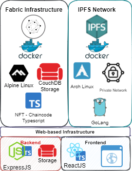
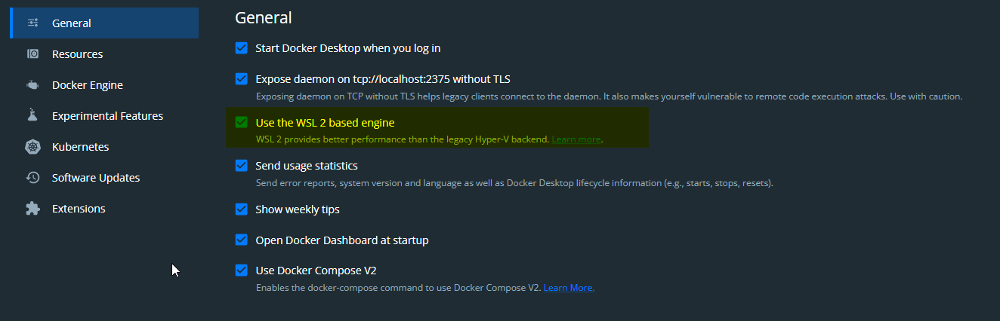

# NFT as a proof of Digital Ownership-reward system integrated to a Secure Distributed Computing system Managed by Blockchain
*** Se video below for a quick demo and usage of the tool.


## Summary
This is a Thesis project for my masters degree in Data Science provided by University of Stavanger.
The purpose of this work is to demonstrate the feasibility and potential to implement an NFT-Based system to store and manage ownership of data, contribute to the newtork and use Proof of Ownership as the consensus mechanism.


### A permissioned Blockchain-based network
The project simulates the interaction between two organization in a permissioned blockchain network where they can:
* Upload a data file system with its metadata
* Mint uploaded data as an NFT and store the resulted hash or IPFS-CID into their own database as a proof of ownership.
* Transfer the generated NFT Asset
* Burn the NFT
* Extend the NFT

Thus, the project aims to show the potential a solution like this has to be implemented in real applications for corporate organizations.

## Purpose
This thesis project emerged by the need to overcome security threats and data breaches as well as to explore a way to share and contribute in a commonly shared data repository similar to what current oil companies use in Norway.

## Technologies
### [Hyperledger Fabric 2.2](https://hyperledger-fabric.readthedocs.io/en/release-2.2/)
Open-source enterprise blockchain technology, with particular permissioned capabilities, authorization and consensus.
### [IPFS](https://ipfs.io/#how)
Decentralized file storage system used content-addressed capabilities.
### [ExpressJS](https://expressjs.com)
Backend web application framework for Node.js designed for building web applications and APIs.
### [Typescript](https://www.typescriptlang.org)
A programming language superset of JavaScript developed and maintained by Microsoft.
### [React](https://reactjs.org)
Open-source front-end JavaScript library for building user interfaces based on UI components.
### [Docker](https://www.docker.com)
Set of platform as a service products that use OS-level virtualization to deliver software in packages called containers.

## System Components

### Hyperledger Fabric
### Chaincode
  * Uses [NFT (Erc-721)](https://eips.ethereum.org/EIPS/eip-721) smart contract extension to allow data management
### Private IPFS Network
It is a private network that controls content addressed files and shares the files among different nodes
### Backend
Server application that communicates with the hyperledger network and extends its functionality by an API.
### Frontend
User interface that enables organizations to issue NFT's by uploading data files.

# Repository Structure
## network
Contains all the hyperlesdger fabric implementation for the development of this project
## thesis
Source code for the thesis report written in Latex. Final version can be found here:
## web
Contains all web components for the application program.
### client
Frontend application developed in React and Typescript
### server
Backend server appplication developed in ExpressJS and Typescript
### common
Common data types and utils used by both Backened and server
## REST
A Postman collection to explore and use all the API calls created. Related documentation can be found there to further extend to other applications

## chaincode
Contains the smart contracts and code developed for Fabric NFT system
### token-erc-721
Implementation and extension of Ethereum Standart ERC-721 (NFT) smart contract built in TypeScript.

## resources
Miscelaneous, images and diagrams build to present and explain the system architecture, technologies used and workflows.

# Instructions
To run the project follow the following steps:
## Prerequisites
* A linux operating system or bash scripting shell is required.
* On a windows machine the usage of WSL (any linux distribution) can help to run the project
* Docker Desktop installed (if using Windows with WSL make sure the option 'Use WSL 2 Based engine' or similar is selected).



## 1. Clone the repository
``` bash
git clone https://github.com/asahicantu/NFT-Thesis.git
```
## 2. Change to network folder
Move to the repository's directory and then to the network directory
```bash
cd NFT-Thesis/network
```
## 3. Enable execution mode for all .sh (shell scripting files)
```bash
find . -name "*.sh" -exec chmod +x {} \;
```
## 4. Run the network infrastructure
Execute the following command to create all the network infrastructure in docker, certificates, organizations nad connection files.
```bash
./network start
```
This process will take some minutes to finish running, what it does:
1. Invokes Docker-compose commands to create the docker containers for:
  1. Hyperledger fabric 
  2. Hyperledger explorer and explorerdb (Interface to visualize the blocks in the Ledger)
  3. Hyperledger orderer (Orderer node)
  4. Peer nodes (Peer and CA Orderers for organizations 1 and 2)
  5. IPFS nodes (Bootstrap, and 2 nodes for private network)
### 5. Run web application
1. It is recommended to use two terminals and change to directory `cd web`
2. Execute: `cd server && ./npm run dev` this will execute ExpressJS Web Server
  2.1. Important to run this environment in dev mode to visualize logs and potential resistance to failures
3. In the second terminal execute `cd client && ./npm run start` this will execute React Web App
4. Navigate to the web application (localhost:3000) and select the option menu "Register Organizations"
  4.1. Register Organization 1 By selecting the file "network/organizations/peerOrganizations/org1.example.com/connection-org1.json"
  4.2. Register Organization 2 By selecting the file "network/organizations/peerOrganizations/org2.example.com/connection-org2.json"
5. Select the option menu "Enroll User"
  5.1. Select the organizstion that user will belong, user name (add 'minter' as a default option) and department (set 'deptartment1' as default option)
  5.2 Submit the user enrollment proces. Repeat the process to add more users for both organization 1 and 2
6. Select 'Mint NFT' Option to issue a new NFT.
  6.1 In 'Organization' field set 'Org1', 'minter' as owner and select a file as follows:
  
  6.2. Repeat the process to mint as any NFT as desired
7. Use the menu 'View Tokens' to visualize issued NFTS residing on the IPFS Server

## Stopping the network or restarting the system
To  ensure all files are removed after using the system it is recommended to run the following command with super user privileges:
```bash
cd network
sudo ./network.sh stop
```

This will remove all running docker containers and  organization related connectivity profiles.


## Bencharming with Hyperledger Caliper
For the test and benchmark performances [Hyperledger Caliper](https://hyperledger.github.io/caliper/v0.5.0/getting-started/) was used.
```bash
 docker pull hyperledger/caliper:0.5.0
 ```
 ### Usage:
 ```bash
 docker run --rm hyperledger/caliper:0.5.0 -it bash calipper --version
 ```

 ## Running benchmarking with Hyperledger fabric
 If additional statistics are desired to be run against the Fabric system it is recommended to use and follow the instructions provided by 
 [Hyperlesdger Caliper](https://hyperledger.github.io/caliper/v0.2/installing-caliper/#installing-from-npm).
 Copy all the contents from network/organizations into network/compose/caliper and run docker compose command.
 ```bash
 cd network
 sudo cp -r organizations compose/caliper/ 
 docker-compose -f docker-compose-caliper.yaml up
 ```
 
 ```bash
 npm install --only=prod @hyperledger/caliper-cli@0.5.0
 npx caliper bind --caliper-bind-sut fabric:2.2
 npx caliper launch manager --caliper-workspace . --caliper-benchconfig scenarios/config.yaml --caliper-networkconfig networks/fabric/network-config.yaml
 npx caliper launch manager --caliper-workspace ./ --caliper-networkconfig networks/fabric/test-network.yaml --caliper-benchconfig benchmarks/samples/fabric/fabcar/config.yaml --caliper-flow-only-test --caliper-fabric-gateway-enabled
 ```